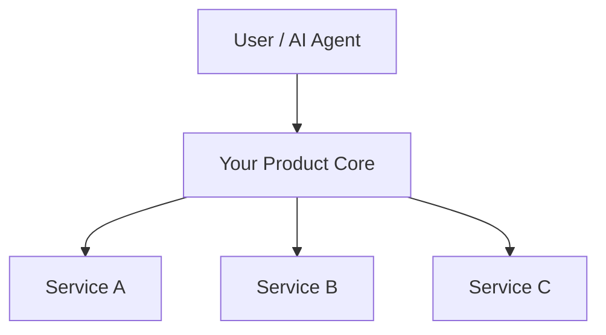

# GitHub README Writing System

> Built from taking AFFiNE from 0 to 60K stars. The README didn't just describe the product — it *was* the product for the first 30 days.
>
> — (AFFiNE case, Iris Wei @WeiYipei, ep01/ep03/ep06)

---

## 双重视角 / Dual Frame: README Writing = Skill Description Writing

One insight from [Claude Code Skills](https://docs.anthropic.com/en/docs/claude-code/skills) that applies directly to README craft:

> "Claude uses the `description` field to decide when to apply the skill."

A README's tagline works by exactly the same logic: **a one-sentence description that makes the right reader self-select in**. If Claude can't tell from your skill's description when to use it, visitors can't tell from your README why they need it.

The table below maps the parallel:

| README element | Skill frontmatter field | Shared principle |
|---------------|------------------------|-----------------|
| Tagline (first line) | `description` first sentence | Specific, scannable, triggers the right reader |
| Sub-description (2–3 sentences) | `description` body | Problem + solution + differentiator |
| Trigger phrases in README | `when_to_use` | Disambiguation — when to use *this*, not something else |
| Architecture/How it works | Supporting files (`reference.md`) | Detail on demand, not always in context |
| Quick Start commands | `allowed-tools` + shell blocks | Concrete, executable, verifiable |

This frame is not a metaphor — it's a practical test. If you can't write a one-sentence tagline for your README that passes the same bar as a skill's `description`, the README needs more work.

---

## 核心原则 / Core Principles

### Principle 1: README is your product's first landing page

The README has one job: convert a GitHub visitor into a star, fork, or install within **3 seconds of first scroll**. Everything else is secondary.

### Principle 2: A weak product can still have a great README

> AFFiNE 开源时产品还是「套壳」demo，README 写对了照样火。
> — (AFFiNE case, Iris Wei @WeiYipei, ep03/ep06)

The README is your narrative. You're selling the *vision and the pain point solved*, not the current feature set. A product at 30% completion with a clear "why you need this" README will outperform a finished product with a feature dump.

### Principle 3: English-first, first screen readable in <3 seconds

> README 英文主，首屏 <3 秒读懂。
> — (AFFiNE case, Iris Wei @WeiYipei, ep03)

The first scroll of a GitHub page is ~600–800px. Everything above the fold must answer: **What is this? Why does it matter? Who is it for?**

### Principle 4: Specific, verifiable instructions beat generic claims

From [Anthropic prompt engineering](https://docs.anthropic.com/en/docs/build-with-claude/prompt-engineering/overview) and [CLAUDE.md effective instructions](https://docs.anthropic.com/en/docs/claude-code/memory):

> "Use 2-space indentation" beats "Format code properly."
> "Run `npm test` before committing" beats "Test your changes."

Apply the same test to README copy:

- "Works offline — no internet required, all data stored locally" ✅
- "Powerful offline support" ❌

Every sentence in a README is an instruction to the reader's brain. Make it concrete enough to verify.

---

## README 结构框架 / README Structure Framework

Derived from analysis of insforge (agentic coding backend), dify (60K+ star LLM platform), and AFFiNE's 0→60K growth.

```
[Logo + Project Name]
[One-line Tagline]              ← most critical, non-skippable
[Badges]                        ← signals, not decoration
[Hero image / Demo video]       ← show product in <30 seconds
[What is this? 2–3 sentences]   ← first screen core
[Quick Start]                   ← shorter = better; just get it running
[Key Features]                  ← sorted by user pain, not tech checklist
[Architecture / How it works]   ← optional; use for complex projects
[Deployment options]            ← cloud / local / one-click
[Claude Code / AI Agent Integration] ← new section; see below
[Contributing]                  ← short, link to CONTRIBUTING.md
[Community & Support]           ← Discord / X / Discussions
[License]
[Star CTA GIF]                  ← ❗️ FIRST 3 SCREENS — inline with hero or after Quick Start
[Star History]                  ← social proof, bottom (optional extra)
```

---

## 首屏 3 秒法则 / The 3-Second First Screen Law

**The rule:** Everything above the first scroll must answer three questions without requiring the reader to think.

| Question | Where to answer |
|----------|----------------|
| What is this? | Tagline (1 sentence) |
| Why should I care? | Sub-description or problem statement (2–3 sentences) |
| Is it real / trustworthy? | Badges: stars, license, downloads, last commit |

**What insforge does right:** Logo → one-line tagline → demo video → 3-sentence expansion. Immediately scannable. The video shows the product without words.

**What dify does right:** Hero image → minimal badge row → 1-paragraph description naming 7 specific features in plain language → immediate Quick Start.

**Common failure mode:** Verbose "About this project" paragraph before anything visual. Developers scan for signals, not introductions.

---

## 各板块写法指南 / Section-by-Section Writing Guide

### Section 1: Tagline

**这是整个 README 最重要的一行 / The single most important line in the README.**

A great tagline does three things simultaneously:
1. Names what the product *is* (category)
2. Names who it's *for* (audience)
3. Names the *pain it kills* (problem)

**Tagline formula (pick one):**

```
[Adjective] [category] for [audience]
→ "Open-source backend platform for AI coding agents"

[Category] without [pain point]
→ "Note-taking without the cloud lock-in"

[Familiar reference] + [key differentiator]
→ "Open source Notion alternative — offline-first, privacy-focused"

[Outcome verb phrase]
→ "Ship full-stack apps from your AI agent, end to end"
```

**AFFiNE case:**

> Tagline: "Open source Notion alternative"
> 6 words hit 3 pain points: Notion offline unavailable, poor data export, privacy.
> — (Iris Wei @WeiYipei, ep01)

The tagline borrows Notion's brand awareness (no explanation needed), and "alternative" signals open-source + self-hostable + "same features without the things you hate" — all simultaneously.

**Rules:**
- ≤ 12 words
- No jargon requiring prior knowledge of your project
- Must work without context — imagine someone sees only this one line
- Never start with "A powerful..." or "An amazing..." — these signal the writer doesn't know what makes the product special

**Connection to skill design:** This is identical to the `description` field rule from [Skills docs](https://docs.anthropic.com/en/docs/claude-code/skills): "Put the key use case first." The first sentence is truncated in skill listings — and in GitHub search results.

---

### Section 2: Hero Image / Demo Video

**Show before you tell.**

A 30–60 second demo video reduces cognitive load by ~80%. If no video, a high-quality screenshot or GIF showing actual product use is non-negotiable for UI products.

For CLI / SDK tools: a `mermaid` architecture diagram + installation command is the equivalent.

**Rules:**
- Video ≤ 60 seconds, captioned (non-English speakers are a large part of your audience)
- Screenshot shows product *in use*, not empty state
- Host on GitHub's own CDN — drag into the issue editor, not external CDN
- Dark and light mode variants if supported

---

### Section 3: Quick Start

**This section's only job: get the user to a running instance as fast as possible.**

```bash
# 3–5 commands max. No explanations between commands.
git clone https://github.com/yourorg/yourrepo
cd yourrepo
docker compose up -d
# → open http://localhost:3000
```

**Rules:**
- If setup takes >5 commands, the problem is onboarding, not the README
- Prerequisites go *above* the commands, not buried in a footnote
- Provide a cloud/hosted version link as an alternative — "Don't want to self-host? Try cloud.yourproject.com"
- The commands must actually work on a fresh machine. **Test this.**

**What dify does right:** Quick Start is literally the *second section* after the description. Minimum system requirements (CPU/RAM), then 4 commands. No architecture essay first. Get them running, then explain.

---

### Section 4: Key Features

**Sort by user pain, not technical implementation.**

❌ Wrong (technical list):
```
- WebSocket support
- Plugin architecture
- REST API
- TypeScript SDK
```

✅ Right (pain-first):
```
- Works offline — no internet required, all data stored locally
- Export everything — Markdown, PDF, raw JSON, always your data
- Self-hostable — deploy to your own server in 5 minutes
- Plugin API — extend with your own tools
```

**Rules:**
- ≤ 7 features in the main list. More than 7 signals "we don't know what we are."
- Each bullet: pain point first, implementation detail second
- Bold the key word — GitHub renders bold in feature lists; it's free hierarchy
- If star count is high, mention it implicitly ("used by X developers") — social proof in the features section

---

### Section 5: Architecture / How It Works (Optional)

Include when:
- Project has non-obvious component structure (backend platform, distributed system)
- Developers need to understand architecture to decide whether to contribute
- Targeting developers who will integrate, not just use

**Rules:**
- Use `mermaid` — renders natively on GitHub. One diagram = 200 words.
- Keep the diagram to ≤ 8 nodes
- Put this section *after* Quick Start



---

### Section 6: Deployment Options

Address all three developer modes: local dev, self-hosted production, cloud.

```markdown
| Method | Link | When to use |
|--------|------|-------------|
| Cloud (hosted) | [yourproject.com](link) | Zero setup, try now |
| Docker Compose | [Quick Start](#quick-start) | Self-hosted, recommended |
| Railway / Render | [one-click deploy](link) | Self-hosted, no Docker |
| From source | [Dev Guide](link) | Contributing |
```

One-click deploy buttons (Railway, Render, Zeabur, Sealos) are high-signal trust indicators and reduce friction to zero for non-Docker users.

---

### Section 7: Claude Code / AI Agent Integration ← New Section

**Add this section if your project:**
- Can be used as a Claude Code skill or MCP plugin
- Has a CLI that AI agents can invoke
- Exposes an API that agentic workflows call

```markdown
## Claude Code / AI Agent Integration

Install as a skill (Claude Code):
\```
npx skills add your-project-name
\```

Or reference directly in your `CLAUDE.md`:
\```markdown
@your-project/README
\```

For MCP integration:
\```json
{
  "mcpServers": {
    "your-project": {
      "command": "npx",
      "args": ["-y", "@your-org/your-mcp-server"]
    }
  }
}
\```
```

**Why this matters:**
- Claude Code skills load from `~/.claude/skills/` or `.claude/skills/` — your README is often the first thing the skill system reads to understand what the project does ([Skills docs](https://docs.anthropic.com/en/docs/claude-code/skills))
- The `/run` and `/verify` bundled skills infer launch from your README — a clear Quick Start section directly improves AI agent onboarding
- GEO (Generative Engine Optimization): structured, machine-readable README sections increase the probability that AI systems cite your project accurately

---

### Section 8: Contributing

Keep short. Guide lives in `CONTRIBUTING.md`.

```markdown
## Contributing

PRs welcome. See [CONTRIBUTING.md](CONTRIBUTING.md) for setup.

Questions? Join [Discord](link) or open a [Discussion](link).
```

Do **not** put a full contributing guide in the README. It breaks reading flow and buries the CTA in prose.

---

### Section 9: Community & Support

Match channel to action type — don't list channels without explaining purpose:

```markdown
## Community & Support

- **Discord** — questions, help, show what you built
- **GitHub Discussions** — feature requests, long-form questions
- **GitHub Issues** — bugs only
- **X / Twitter** — announcements, follow for updates
- **Email** — security issues, enterprise inquiries
```

---

### Section 10: Star History Chart

Put at the bottom. Social proof, not navigation.

```markdown
[](https://star-history.com/#yourorg/yourrepo&Date)
```

A steep upward curve signals "this project is real." Investors use this too.

> 投资人专门写爬虫查 Star 真假，说明真实口碑就是你最有力的信号。
> — (AFFiNE case, Iris Wei @WeiYipei, ep03)

---

### Section 11: Star CTA GIF — The Most Underused Conversion Trick

A short GIF showing the mouse clicking the ★ Star button converts passers-by into stargazers. It sounds trivial. It works.

**Why it works:**
- Removes ambiguity: many first-time visitors don’t know *where* to click to star
- Creates micro-commitment: watching the animation primes the action
- Feels human, not spammy — unlike a bold "PLEASE STAR US" text block

**How to make the GIF (3 options):**

| Option | Tool | Time | Quality |
|--------|------|------|---------|
| Screen record + convert | QuickTime (Mac) + Gifox / LICEcap / ScreenToGif | 5 min | ★★★★ |
| Browser extension | [Screencastify](https://www.screencastify.com/) or [Loom](https://www.loom.com/) → export GIF | 3 min | ★★★ |
| Online recorder | [Giphy Capture](https://giphy.com/apps/giphycapture) (Mac) | 3 min | ★★★ |

**What to record (exact steps):**
1. Open your repo in browser, zoom to 125%
2. Slowly move mouse to the ★ Star button (top right area)
3. Pause 1 second
4. Click — let the animation play (star turns yellow)
5. Total duration: 3–5 seconds, loop seamlessly

**GIF specs:**
- Size: 400–600px wide, auto height
- Duration: 3–5 seconds, looping
- File size: keep under 1MB (GitHub CDN limit for smooth load)
- Optimize with [Ezgif](https://ezgif.com/optimize) if over 1MB

**Placement in README: First 3 screens, not the bottom**

> ❗️ Most repos bury the star CTA at the bottom. By then, 80%+ of visitors have already left.
> Put it where people actually see it.

**Option A — Inline with Hero (recommended):**
Right after the tagline + badges, before Quick Start. Catches visitors while they’re still deciding whether to care.

```markdown
## About

Open source Notion alternative. [tagline...]

⭐ **If this looks useful, star it** — it helps others find the project.


```

**Option B — After Quick Start (second-best):**
After users successfully run the project, strike while the iron is hot.

```markdown
## Quick Start

```bash
npm install yourproject
```

It works? ⭐ [Star this repo](https://github.com/yourorg/yourrepo) — takes 2 seconds.


```

**Option C — Star History at the bottom (in addition to A or B, not instead):**

```markdown
## ⭐ Star History

[](https://star-history.com/#yourorg/yourrepo&Date)
```

**Rule: always use A or B. C is optional extra.**

**Store the GIF in your repo:**
```
yourrepo/
└── assets/
    └── star-demo.gif   ← commit this
```

**Tone guidance:**
- ✅ `"If this project helped you, a star means a lot"`
- ✅ `"Star us to stay updated"`
- ❌ `"PLEASE GIVE US A STAR!!!"`
- ❌ `"Don’t forget to star!"` (implies obligation)

> The GIF does the asking so the text doesn’t have to.

---

## Badge 使用原则 / Badge Usage Principles

Badges are **signals**, not decoration. Each badge answers a developer question.

| Badge type | Question answered | Include? |
|-----------|-------------------|----------|
| License | "Can I use this commercially?" | Always |
| Stars | "Is this popular / maintained?" | Always |
| Last commit | "Is this abandoned?" | Yes |
| Build / CI status | "Does it actually work?" | Yes |
| Downloads (npm/docker/pypi) | "Is anyone actually using this?" | Yes if >1K |
| Code coverage | "Is the code quality real?" | Only if >70% |
| Version | "What's stable?" | Yes for libraries |
| "Made with X" partner badges | — | Omit unless required |

**Rules:**
- ≤ 8 badges on the first row. More = visual noise.
- Group by meaning: identity → health → community
- Never use a failing badge. A red CI badge is worse than no CI badge.

---

## 常见死亡模式 / Anti-patterns (README Death Modes)

### ❌ Death Mode 1: Feature Dumping Without Problem Framing

```markdown
Features:
- Real-time collaboration
- Markdown support
- Plugin system
- REST API
- Mobile app
- Dark mode
```

Tells me nothing about who this is for or why I need it.

**Fix:** Lead with the pain. "If you've ever lost work because [X happened], MyApp solves that."

---

### ❌ Death Mode 2: Burying Quick Start

Quick Start below the second scroll = 60% of developers already gone.

**Fix:** Quick Start is section 2 or 3. Maximum.

---

### ❌ Death Mode 3: Generic Tagline

```
A powerful, flexible, and extensible framework for modern developers.
```

"Powerful," "flexible," "extensible" — every project makes these claims. This is noise.

**Fix:** Name the specific pain. Name the specific category. Name the specific user.

**Prompt engineering parallel:** Per [Anthropic's guidance](https://docs.anthropic.com/en/docs/claude-code/memory#write-effective-instructions), vague instructions ("Format code properly") produce inconsistent results. Same principle: vague taglines produce inconsistent reader behavior.

---

### ❌ Death Mode 4: No Visual Above the Fold

Wall of text → wall of text → wall of text. Developers scan; they don't read.

**Fix:** Hero image or demo GIF immediately after the tagline. Non-negotiable for UI products.

---

### ❌ Death Mode 5: README Only in Native Language

> README 英文主，首屏 <3 秒读懂。
> — (AFFiNE case, Iris Wei @WeiYipei, ep03)

Chinese-only, Japanese-only README caps addressable audience. GitHub Trending, HN, Reddit — all English-first platforms.

**Fix:** English is the primary document. Translated versions via badges or `/i18n/` folder.

---

### ❌ Death Mode 6: Contributing Section as Wall of Text

If `## Contributing` runs for 400 lines in the README, it's buried in prose and no one reads it.

**Fix:** One paragraph + link to `CONTRIBUTING.md`. README is a landing page.

---

### ❌ Death Mode 7: Treating Stars as Vanity Metrics

Stars are distribution signals. GitHub Trending, search ranking, investor due diligence — all use star velocity as a legitimacy proxy.

> AFFiNE hit 6K stars in week 1, 10K in month 1, 60K+ total. 28 consecutive GitHub Trending appearances, driven by two weeks of obsessive community engagement.
> — (Iris Wei @WeiYipei, ep01/ep06)

A README that converts well drives star velocity → drives trending → drives more stars. README is the entry point of this loop.

---

### ❌ Death Mode 8: No AI Agent / Claude Code Section (2025+)

As of 2025, a meaningful portion of GitHub visitors are AI coding agents or users who will try to use your project through Claude Code, Cursor, or similar tools. A README that doesn't include an AI agent integration section is missing a fast-growing install path.

**Fix:** Add [Section 7: Claude Code / AI Agent Integration](#section-7-claude-code--ai-agent-integration).

---

## AFFiNE 核心数据 / AFFiNE Data Points for Context

All sourced from Iris Wei (@WeiYipei) podcast episodes (ep01 / ep03 / ep06):

| Metric | Value | Source |
|--------|-------|--------|
| Stars, week 1 | 6,000 | ep01/ep03 |
| Stars, month 1 | 10,000 | ep01 |
| Stars, total | 60,000+ | ep01/ep03 |
| GitHub Trending appearances | 28 consecutive | ep06 |
| Tagline strategy | "Open source Notion alternative" — targeted offline / data export / privacy pain | ep01 |
| Product state at launch | "套壳" demo (wrapper demo, incomplete) | ep03/ep06 |
| What drove trending stays | Obsessive community reply for first 2 weeks | ep06 |
| What drove initial launch | Dev docs + traffic funnels + content prepared pre-launch | ep01 |
| Investor signal | Investors wrote crawlers to verify star authenticity | ep03 |

**Key insight:** Product was a wrapper demo at launch. The README hit the right pain points. Result: 6,000 stars in week 1. **README is not a product feature — it is the marketing layer, and it works independently of product completeness.**

---

## 发布前自检 Checklist / Pre-publish Checklist

Run before every README publish or major update.

### First screen (no scroll required)
- [ ] Logo / project name visible and clear
- [ ] Tagline ≤ 12 words, answers: what + who + pain
- [ ] Hero image, GIF, or demo video within first screen
- [ ] Badge row present, ≤ 8 badges
- [ ] No wall of text before any visual element

### Content
- [ ] Quick Start is in the top 3 sections
- [ ] Quick Start has ≤ 5 commands and works on a fresh machine
- [ ] Features sorted by user pain, not technical implementation
- [ ] Each feature bullet leads with benefit, not mechanism
- [ ] Contributing section ≤ 1 paragraph + link to CONTRIBUTING.md

### Language & tone
- [ ] Primary language is **English**
- [ ] No "powerful," "flexible," "amazing," "robust" — replace with specifics
- [ ] No "we believe in open source" preamble — cut to the point
- [ ] Tagline does not start with "A" or "An"

### Trust signals
- [ ] License badge present
- [ ] CI / build status badge present *and passing*
- [ ] Star history chart at the bottom
- [ ] Star CTA GIF in first 3 screens (assets/star-demo.gif, <1MB, 3–5s loop) — NOT at the bottom
- [ ] Discord / community link in the README
- [ ] If star count >500, visible in badges

### Technical
- [ ] All links tested (no 404s)
- [ ] Images hosted on GitHub CDN (not external)
- [ ] `mermaid` diagrams render correctly in GitHub preview
- [ ] One-click deploy buttons tested (if applicable)
- [ ] README renders correctly on mobile (check GitHub mobile)

### AI-era additions
- [ ] **skill-ready:** Is there a clear `npx skills add` or MCP install command?
- [ ] **GEO-ready:** Does the README have structured, machine-readable sections (tables, headers, code blocks) that AI systems can cite accurately?
- [ ] **Agent-friendly Quick Start:** Can Claude Code's `/run` skill infer the launch command from your README without a custom skill setup?

---

## 快速诊断 / Quick Diagnosis

When someone sends you a README to review, run through this in order:

1. **Read only the first screen (simulate no scroll).** What do you know about the product? Who it's for? Why it matters? If you can't answer all three, the tagline or hero section needs rewriting.

2. **Find Quick Start.** Count which section number it is. If ≥ 5, it needs to move up.

3. **Read the tagline aloud.** Does it sound like a human pitch, or a feature list? If the latter, rewrite using the pain-first formula.

4. **Count the features.** If >7 bullets, ask: which 3 make someone install this? Keep those, cut the rest.

5. **Look for walls of text.** Any paragraph >5 lines above the Contributing section is probably explaining something a diagram or demo does better.

6. **Check language.** Is the primary language English?

7. **Check AI integration.** Is there a Claude Code / AI agent section? Does the Quick Start work for automated install? (New in 2025.)

---

## References

### Claude Code 官方文档 / Claude Code Official Docs
- [Skills — frontmatter spec, context:fork, allowed-tools, when_to_use](https://docs.anthropic.com/en/docs/claude-code/skills)
- [Memory — CLAUDE.md 4-layer scope, effective instructions, specificity rules](https://docs.anthropic.com/en/docs/claude-code/memory)
- [Prompt engineering overview](https://docs.anthropic.com/en/docs/build-with-claude/prompt-engineering/overview)
- [Claude Code documentation home](https://docs.anthropic.com/en/docs/claude-code/overview)
- [Subagents](https://docs.anthropic.com/en/docs/claude-code/sub-agents)

### Anthropic 课程 / Courses
- [Claude Code 101 (SkillJar)](https://anthropic.skilljar.com/claude-code-101)
- [Prompt Engineering Interactive Tutorial](https://docs.anthropic.com/en/docs/build-with-claude/prompt-engineering/prompt-engineering-tutorial)
- [Anthropic Academy](https://www.anthropic.com/academy)

### 提示工程 / Prompt Engineering
- [Be specific and direct](https://docs.anthropic.com/en/docs/build-with-claude/prompt-engineering/be-specific-and-direct)
- [Use XML tags](https://docs.anthropic.com/en/docs/build-with-claude/prompt-engineering/use-xml-tags)

### 社区资源 / Community
- [Anthropic Discord](https://discord.com/invite/anthropic)
- [Claude Code GitHub Discussions](https://github.com/anthropics/claude-code/discussions)

### 案例 README / Case Study READMEs
- [AFFiNE](https://github.com/toeverything/AFFiNE) — 0→60K stars case study (primary reference)
- [Dify](https://github.com/langgenius/dify) — 60K+ star LLM platform, aggressive Quick Start placement
- [InsForge](https://github.com/insforgehq/insforge) — agentic coding backend, clean tagline + mermaid architecture

---

*By Iris (生姜 Iris) · ex-COO @ AFFiNE (0 → 60k★)*
*For overall OSS growth strategy → use `gr-oss-marketing` or `gingiris-opensource`*
*For README writing specifically → this is the skill*
